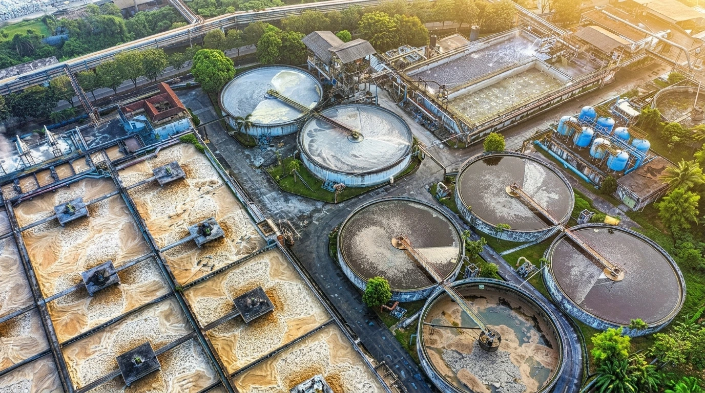

# 🌿 EcoReve - Environmental Protection & Wastewater Equipment Platform



**EcoReve** adalah platform web modern bertaraf internasional yang berfokus pada penyediaan solusi rekayasa pengolahan air limbah industri (*Industrial Wastewater Treatment*), instrumen analisis air, sistem otomatisasi, katup/valves, dan peralatan utilitas energi ramah lingkungan.

---

## 🎯 Gambaran Umum Proyek

Aplikasi web ini dibangun dengan arsitektur **Clean, Modular, dan Scalable** yang siap digunakan untuk skala enterprise. Proyek ini mendukung **5 Bahasa** (*English, Indonesian, Malay, Chinese, Thai*) serta dirancang secara khusus **CMS-Ready** untuk mudah terhubung dengan **Backend RESTful API Laravel Admin** di masa mendatang.

---

## 🛠️ Technology Stack

### 🎨 Frontend Framework & UI (Saat Ini)
- **Core Framework**: [Vite](https://vitejs.js.org/) + [React 19](https://react.dev/) + [TypeScript](https://www.typescriptlang.org/)
- **Routing**: [TanStack Router](https://tanstack.com/router)
- **Styling & UI Components**: [Tailwind CSS v4](https://tailwindcss.com/) + [shadcn/ui](https://ui.shadcn.com/) (Primitives & Radix UI Utilities) + Custom CSS Glassmorphism
- **Internationalization (i18n)**: Custom React i18n Context (`EN`, `ID`, `MS`, `ZH`, `TH`) dengan auto-persistence ke `localStorage`.
- **Icons & Flags**: [Lucide React](https://lucide.dev/) + [React Country Flag](https://github.com/danielsogl/react-country-flag)
- **Runtime & CLI**: [Bun](https://bun.sh/) (`bunx --bun shadcn@latest init`) / Node.js

### ⚙️ Backend (Arsitektur Masa Depan / Ready for Integration)
- **Framework**: [Laravel 11 RESTful API](https://laravel.com/)
- **Database**: MySQL / PostgreSQL (Model Produk, Kategori, Artikel Berita, Video, & Terjemahan CMS)
- **Admin Panel**: Custom CMS Administrator (Mendukung operasi CRUD penuh untuk mengelola konten landing page)

---

## ✨ Fitur-Fitur Utama (Key Features)

### 🌐 1. Dukungan Multi-Bahasa 5 Negara (i18n System)
Dukungan penuh terjemahan bahasa instan tanpa *page reload*:
- 🇬🇧 **English (EN)** - *Default*
- 🇮🇩 **Bahasa Indonesia (ID)**
- 🇲🇾 **Bahasa Melayu (MS)**
- 🇨🇳 **简体中文 (ZH)**
- 🇹🇭 **ภาษาไทย (TH)**

### 📱 2. Header & Fullscreen Mobile Menu Overlay Responsive
- **Pixel-Perfect Matching Header**: Animasi buka-tutup menu mobile presisi dengan transisi kanan-ke-kiri (*right-to-left swipe*).
- **Mega Menu Dropdown**: Katalog Produk & Layanan Teknis tanpa titik bullet dengan warna teks *hover* hitam pekat yang kontras dan jelas.
- **Kartu Footer Gelap di Overlay**: Kartu pernyataan komitmen perlindungan lingkungan EcoReve (`#1a2328`) yang disertakan di bagian bawah drawer mobile.

### 🏭 3. Section Landing Page Komprehensif
- **Hero Section**: Banner beresolusi tinggi dengan *gradient overlay* gelap, teks headline putih kontras, serta *metrics badge* (100+ Enterprise Clients, 50+ Solutions).
- **Industrial Challenges Section**: Tab interaktif 4 tantangan utama air limbah industri.
- **Engineering Solutions Carousel**: Carousel kartu kategori pengolahan air (*Water Treatment, Valves Automation, Utility Energy, Water Analysis, Filtration Membranes*).
- **Featured Products Catalog**: Katalog produk unggulan dengan filter tab kategori dinamis.
- **EcoReve Systems in Action**: Pemutar video demonstrasi teknis dengan *scrollable sidebar playlist*.
- **Pioneering Clean Water Section**: Kartu indikator kinerja (*Recycling Rate 99.8%, 24/7 Monitoring, -35% Energy Consumption*).
- **Global Offices Footer**: Informasi kantor pusat Tiongkok (Qingdao) dan kantor cabang Malaysia (Puchong, Selangor).

---

## 🏗️ Struktur Folder Proyek (Folder Architecture)

```graphql
src/
├── assets/                    # Aset gambar (.webp, .png) & ikon lokal
├── types/                     # Definisi Interface TypeScript (Product, Service, i18n)
├── data/                      # Data statis & fallback mock (Navigation, Products, Problems)
├── i18n/                      # 🌐 Sistem Multi-Bahasa
│   ├── locales/               # Kamus terjemahan (en.ts, id.ts, ms.ts, zh.ts, th.ts)
│   ├── LanguageContext.tsx    # State Provider Bahasa Aktif
│   └── useTranslation.ts      # Custom Hook i18n
├── services/                  # 🔌 Layer RESTful API Client Laravel (api.ts)
├── components/                # 🧩 Komponen UI Modular
│   ├── layout/                # Navbar, MobileDrawer, LanguageDropdown, Footer
│   └── sections/              # Section Hero, Problem, Carousel, Products, Video, CleanWater
├── routes/
│   ├── __root.tsx
│   └── index.tsx              # Clean Page Assembly (~70 baris kode)
└── styles.css
```

---

## 🚀 Cara Menjalankan Proyek Secara Lokal

1. **Clone Repository**:
   ```bash
   git clone https://github.com/muhdfhri/ecoreve.git
   cd ecoreve
   ```

2. **Install Dependensi**:
   ```bash
   bun install
   # atau menggunakan npm / pnpm / yarn:
   # npm install
   ```

3. **Jalankan Server Development**:
   ```bash
   bun dev
   # atau:
   # npm run dev
   ```
   Aplikasi akan berjalan di `http://localhost:3000` (atau port yang ditunjukkan di terminal).

4. **Build untuk Produksi**:
   ```bash
   bun run build
   ```

---

## 📜 Lisensi & Copyright

© 2026 **Qingdao Topolar New Material Co.,Ltd. / EcoReve Environmental Equipment**. All rights reserved.
